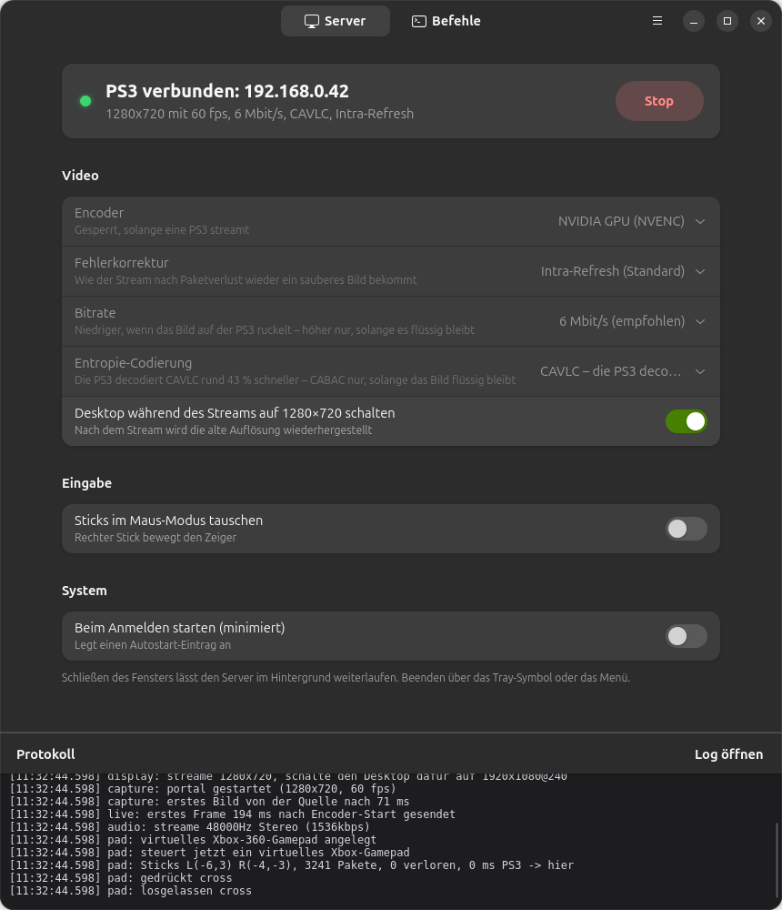
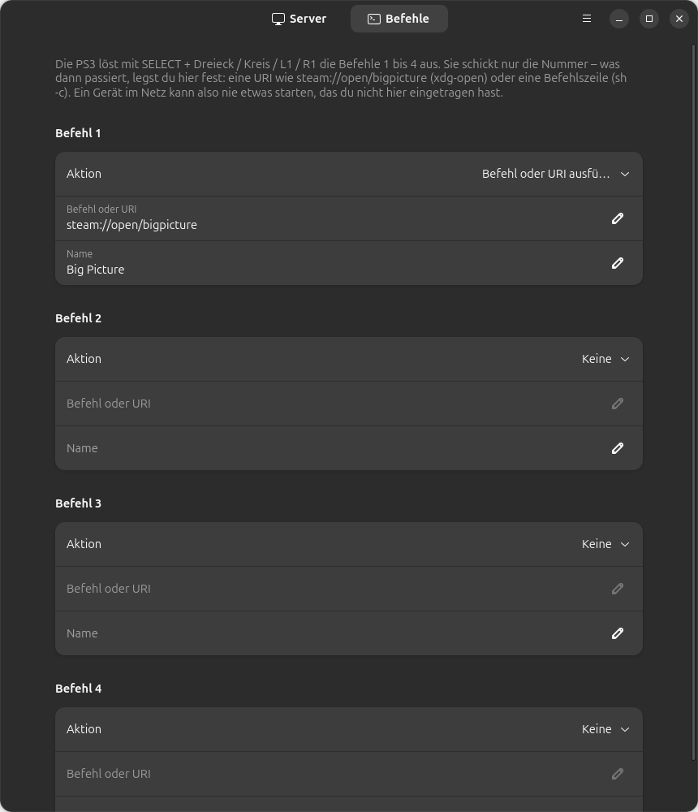

# TEE Cell Stream Server Linux

Stream your Linux desktop to a PlayStation 3 and play PC games with the PS3 controller — Remote Play the
other way round. Linux port of the Windows tool `cell-stream-server` from
[ps3-dev](https://github.com/mohasi/ps3-dev) (Apache-2.0). The PS3 side, the homebrew app **cell-stream**,
is unchanged: this server speaks its wire protocol byte for byte.

*Deutsche Anleitung: [README.de.md](README.de.md)*



**Full HD at 60 fps, on a console from 2006.** Measured against a real PS3 — x264 at 12 Mbit/s with CAVLC,
Ryzen 9 5900X + RTX 4070 Ti SUPER, Ubuntu 26.04, GNOME 50 on Wayland:

| Stream size | Pixels vs 720p | Frame rate | End-to-end latency | Decode on the PS3 | Dropped |
|---|---|---|---|---|---|
| 1280 × 720 | 1.00× | 60 fps | 25–30 ms | 19–22 ms | 0 of 893 |
| 1792 × 1008 | 1.96× | 60 fps | 40–47 ms | 38–42 ms | 0 |
| **1920 × 1088** | **2.27×** | **60 fps**, longest gap 27 ms | **40–47 ms** | **38–44 ms** | **0** over a full match |

That is not what the Windows original found — it measured 1080p at 80–120 ms and 27 fps, and with an NVENC
stream this port reproduces exactly that. The difference is not the console but the encoder; see
[The encoder decides what the console can do](#the-encoder-decides-what-the-console-can-do).

Two caveats on those numbers. **The PC and the PS3 were joined by a single Ethernet cable**, with no switch
or router between them, so the network term is a best case and every extra hop adds to it. And decode time
is a figure *under motion*: a still picture costs a fraction of it, because H.264 codes differences.

## What you need

- **A PS3 with HEN or CFW**, running `cell-stream.pkg` from the
  [ps3-dev release](https://github.com/mohasi/ps3-dev/releases/tag/174-a5dd795). Without it there is
  nothing to stream to — this package is only the PC half.
- **A Linux desktop with a screen-sharing portal**: GNOME on Wayland is what this was built and measured
  on; X11 works through a fallback. Everything else comes from your distribution's own packages.
- **A GPU that encodes H.264** (NVIDIA NVENC or Intel/AMD VA-API), or a CPU fast enough for x264.

## Install

```
sudo apt install ./tee-cell-stream-server_1.18.0_all.deb
```

Get the `.deb` from [Releases](../../releases). Then **log out and back in once** — GNOME only reads newly
installed shell extensions when a session starts, and the bundled one is what keeps the capture alive
while a game runs fullscreen. After that the server switches it on by itself.

## Use it

Start **TEE Cell Stream Server**, confirm the screen-share prompt once, then start **Cell Stream** on the
PS3. There is nothing else to press: the console finds the server by itself (discovery beacon), connects
and streams. Either side can be started first, and each reconnects on its own.

While streaming, every button goes to the PC, so the PS3 app uses SELECT as its own modifier:

| Combination | What it does |
|---|---|
| SELECT + Cross | input mode: mouse+keyboard ↔ gamepad |
| SELECT + Square | presentation mode: vsync off → vsync → vsync + one-frame buffer |
| SELECT + R3 | show/hide the stats panel |
| SELECT + Triangle/Circle/L1/R1 | custom commands 1–4 |

## Resolutions

Five sizes, selectable while the server is idle:

| Stream size | Pixels vs 720p | Aspect (16:9 = 1.778) | |
|---|---|---|---|
| 1280 × 720 | 1.00× | 1.778 | the default |
| 1408 × 800 | 1.22× | 1.760 | |
| 1536 × 864 | 1.44× | 1.778 | |
| 1792 × 1008 | 1.96× | 1.778 | |
| 1920 × 1088 | 2.27× | 1.765 | Full HD — measured at 38–44 ms decode |

**1920 × 1088 is the ceiling, and it is the decoder's.** 2048 × 1152, 2560 × 1440 and 3840 × 2160 were
offered for one release and tried on the console: none of them connected at all — no picture, no error,
the PS3 simply refused. That is exactly where H.264 level 4.2 stops, at 8704 macroblocks per picture.
1920 × 1088 needs 8160 and fits; 2048 × 1152 needs 9216 and does not. `cellVdec` will not go past 4.2.

**Every one is a multiple of 16, and that is deliberate.** H.264 codes in 16×16 macroblocks, so 1080 is
rounded up to 1088 and 900 to 912 no matter what you ask for — and the PS3 app derives its picture size
from the macroblock count without reading the bitstream's cropping rectangle, so it draws those padding
rows and stretches the picture to fit. Offering 1088 directly is honest about what is actually coded: no
wasted rows, no distortion. 1792 × 1008 is the middle ground — 14 % fewer pixels than Full HD really
costs, at nearly the same sharpness.

**The desktop can follow the stream.** With the switch on, the server sets the desktop to 1280 × 720 or
1920 × 1080 for the duration — standard modes every monitor knows, never 1088 — and puts the old one
back when the stream ends. Because a mode a monitor cannot show leaves a black screen with no way to
click anything, the switch is armed: a dialog asks you to confirm you can still see the picture, and if
nothing is confirmed within 15 seconds the previous mode is restored by itself.

## The encoder decides what the console can do

The PS3 decodes H.264 on its SPUs, and two encoder choices dominate everything else. Both were measured
on the console, not guessed.

**CAVLC, not CABAC.** CABAC's serial arithmetic decoding is the expensive part on an SPU: 36–40 ms per
picture against 19–22 ms for CAVLC at the same bitrate, at 720p. A 60 fps frame gets 16.7 ms, and the
decoder buys itself some slack by running on the SPUs in parallel with the receive thread — but at
36–40 ms that slack is long gone and the console drops every other picture.

**x264 rather than NVENC, if the resolution is high.** `x264 --preset ultrafast` turns the in-loop
deblocking filter off, and that filter is most of what H.264 costs to decode. Measured on the console at
1920×1088: **147 ms per picture with NVENC, 38–44 ms with x264** — and `behind` went from climbing by
about 53 a second to a flat zero. The picture is blockier, which more bitrate partly buys back.

**Bitrate is almost free, and almost pointless.** At 1792×1008, going from 12 to 35 Mbit/s changed decode
by 2 ms and added 5 ms of latency. For this decoder it is pixels that cost, not bits. Set it high enough
to look good and no higher.

**Eleven bytes in the SPS are worth 13–22 ms.** H.264 can carry HRD parameters — timing information that
tells a decoder when it may hand a picture on. Without them the PS3 evidently buffers one first. Measured
at 1920×1088, changing nothing else:

| stream | latency |
|---|---|
| plain VBR, no HRD | 42–55 ms |
| a pinned constant rate, still no HRD | 44–52 ms |
| **VBR with HRD** | **29–33 ms** |
| CBR (pinned rate, HRD, filler padding) | ≤32 ms |

The middle row is what proves it: pinning the rate without the timing parameters changed nothing, so it
is not uniform frame sizes the console likes — it is knowing when to let go of a picture. `x264`'s
`nal-hrd` writes them, they cost eleven bytes once per stream, and every rate control here carries them.

**Three rate controls**, x264 only: *variable* is the default; *constant quality* targets a quality
instead of a rate, so a still desktop costs almost nothing and its text still stays sharp — the case
plain VBR handles worst; *constant bitrate* holds the rate exactly and pads with filler NAL units, which
the sender then drops again.

## Two things Linux needs that Windows does not

Both were measured on the console, not guessed. Together with the encoder choices above they are the
reason a straight port of the Windows server runs at about 25 fps here while this one runs at 60.

**The desktop's refresh rate decides the frame rate.** GNOME's screen cast hands out only about two thirds
of the refresh rate: 40.1 of 60 fps with the desktop at 1280×720@60, but 60.1 fps at 2560×1440@320 — even
though the second case also has to scale 1440p down to 720p. Since 1280×720 tops out at 60 Hz on most
monitors, the Windows original's trick of matching the desktop to the stream size costs a third of the
frames here. This server instead picks the smallest mode with at least 1.5× the frame rate.

**Fullscreen games freeze the capture.** When Mutter hands a fullscreen window straight to the monitor
(direct scanout) it stops compositing it, so the screen cast has nothing left to copy: the picture freezes
while sound and input carry on ([mutter#3074](https://gitlab.gnome.org/GNOME/mutter/-/work_items/3074),
[#3903](https://gitlab.gnome.org/GNOME/mutter/-/work_items/3903)). The bundled GNOME extension turns direct
scanout off while the server runs and restores it afterwards.

## What it does

Screen capture through xdg-desktop-portal/PipeWire (X11 fallback via `x11grab`), H.264 through NVENC,
VA-API or x264 with the original's low-latency encoder settings (no B-frames, intra refresh, one slice),
uncompressed desktop audio, and the PS3 controller replayed as either a virtual Xbox 360 gamepad
(`/dev/uinput`) or as mouse and keyboard with correct keyboard-layout handling via libxkbcommon.

The window is GTK4/libadwaita with a tray icon, autostart and four user-defined commands the console can
trigger. **Its interface is in German**, as is `README.de.md`; the code and its comments are in English.



## When the PS3 shows fewer than 60 fps

`README.de.md` has the full troubleshooting chapter. The short version: read the console's stats panel
(SELECT + R3) and look at `decode`. Above 16.7 ms the PS3 cannot sustain 60 fps and starts dropping —
`behind` is the counter that then climbs. Three settings move it, in this order:

1. **Entropy coding → CAVLC.** The largest single lever at any resolution.
2. **Encoder → x264**, above 720p. It is the only one of the three that can switch the deblocking filter
   off, and above 1536×864 that is the difference between playable and not.
3. **A smaller stream size.** Decode cost tracks pixels almost linearly, which bitrate does not.

To measure what actually leaves for the console rather than guessing:

```
sudo tools/wire-fps.py <PS3-IP> -d 30
```

It counts the video frames on the wire and tells you from the gap distribution whether the source is
producing fewer or whether something is dropping them.

## Development

```
PYTHONPATH=src python3 -m teecellstream            # the app
PYTHONPATH=src python3 -m teecellstream --headless # server only, no window
PYTHONPATH=src python3 -m unittest discover -s tests
bash tests/run_integration.sh                      # a fake PS3 against the real server
bash packaging/build-deb.sh                        # → dist/*.deb
```

407 unit tests plus an integration test that impersonates a PS3 client and checks the stream against what
the console expects: fragment layout, clock sync, frame pacing, audio packet rate and the controller
channel. `SPEC.md` documents every module's contract and, where behaviour deviates from the Windows
original, the measurement that justified it.

## Credits and licence

Apache-2.0, like the original. The PS3 application, the Windows server this was ported from and the
application icon are the work of [mohasi](https://github.com/mohasi/ps3-dev); `upstream/` keeps unmodified
reference copies of the sources this was checked against, and `NOTICE` records who did what.
